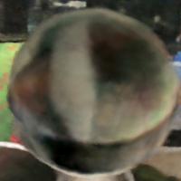
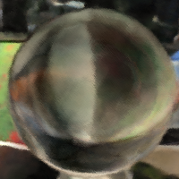

Neural Raidance Fields with Refractions
==================================

**University of Pennsylvania, CIS 565: GPU Programming and Architecture, Final Project**

* Zhangkaiwen Chu
  * [LinkedIn](https://www.linkedin.com/in/zhangkaiwen-chu-b53060225/)
* Tested on: Windows 10, R7-5800H @ 3.20GHz 16GB, RTX 3070 Laptop GPU 16310MB (Personal Laptop)

This project implement the light-bend neural radiance field (LB-NeRF) which is based on the paper ["LB-NERF: Light Bending Neural Radiance Fields for Transparent Medium"](https://ieeexplore.ieee.org/document/9897642). It aims at modeling the refraction effect with an offset field using a neural network.

## Background
Neural radiance field(NeRF) is a 5D volumetric representation(3D for position, 2D for view angles) of a scene. By numeric intergration through the light ray, the pixel color can be recovered. However, NeRF assumes light travels a straight line. Thus, NeRF is bad at rendering scenes including specular or refractive effects. Since the bending of light in the field of index of refraction is equivalent to applying an offset field to the NeRF, we can use a neural network to learn the offset field, which can model the bending the light without including recurrent architecture in the network. 

## Model Architecture

We first pass the position and direction to the offset network, then we add the position with the offset and pass it to the encoder. Next we pass the encoded position to the density network. We use the first output of the density network as the density, and the whole output s concatenated with the encoded direction and passed to the RGB network. The output is the RGB value.

## Image Quality

| Reference | NeRF | LB-NeRF |
|---|---|---|
|||
| psnr = inf | psnr = 12.6214 | psnr = 12.6082 |

| Reference | NeRF | LB-NeRF |
|---|---|---|
|||
| psnr = inf | psnr = 12.2966 | psnr = 12.4640 |

Due to a slightly offset of the rendered image, the psnr is low. We can find that for the overall quality, nerf is better. But for the glass ball, lb-nerf is better.

## C++ Implementation

For C++ implementation, I based my code on [instant-npg](https://github.com/NVlabs/instant-ngp). I only modified the network architecture, which locates at instant-ngp/include/neural-graphics-primitives/nerf_network.h. However, due to a different choice of encoding, the model do not converge, and it cannot output reasonable images. 

## Usage
The pytorch implemententation locates in the code direcctory, ended with .ipynb.
For c++ implementation, we are using the architecture of [instant-npg](https://github.com/NVlabs/instant-ngp), please refer to this page for details. 

## Reference
[instant-ngp](https://github.com/NVlabs/instant-ngp)
[tiny-cuda-nn](https://github.com/NVlabs/tiny-cuda-nn)
[IB-NeRF](https://ieeexplore.ieee.org/document/9897642)